# Hermes SkillForge — Universal Agent Skill Converter

<div align="center">

[](https://github.com/uthumany/hermes-skillforge/actions/workflows/ci.yml)
[](https://www.npmjs.com/package/hermes-skillforge)
[](https://www.npmjs.com/package/hermes-skillforge)
[](https://www.python.org/)
[](./LICENSE)
[](https://github.com/NousResearch/hermes-agent)
[](https://agentskills.io)

**Convert any skill, repository, or tool into an install-ready [Hermes Agent](https://github.com/NousResearch/hermes-agent) skill.**

*Agent Skills → Claude Skills → Codex → Cursor Rules → MCP Servers → Prompt Packs → GitHub Repos → Plugins → Hermes Skills*

[Installation](#installation) · [Quick Start](#quick-start) · [Features](#features) · [Docs](#documentation) · [Contributing](#contributing) · [License](#license)

</div>

---

## What is Hermes SkillForge?

**Hermes SkillForge** is an open-source, zero-dependency conversion engine that transforms diverse AI-agent source formats into **valid, install-ready Hermes Agent skills** that follow the official authoring standards and pass automated validation and testing.

Whatever you have — an `agentskills.io` skill, a Claude or Codex skill, Cursor rules, an MCP server manifest, a GitHub repository containing an agent workflow, a plugin, a prompt pack, or a script collection — SkillForge analyzes it, maps its capabilities, generates a compliant `SKILL.md`, builds a per-skill test suite, and installs it into `~/.hermes/skills/`.

### Live demo (real output)

```text
$ skillforge convert ./examples/agentskills-source

== Source analysis ==
Format: agent_skills (confidence: medium, score: 2.0)
  - SKILL.md at SKILL.md
  - 1 Python file(s) with function definitions
Capabilities:
  commands: 0, dependencies: 0, scripts: 1, API endpoints: 0, config keys: 1

== Conversion complete ==
Generated: /tmp/hermes-demo1/skillforge/text-transform-pipeline
Dirs created: ['scripts/', 'references/', 'tests/']

== Validation ==
VALID

== Tests ==
passed: 18/18

Action: fresh -> ~/.hermes/skills/software-development/text-transform-pipeline
Installed. Active in a new session; run /reset for the current one.
```

## Features

### Core capabilities

| Feature | Description |
|---|---|
| **Universal format detection** | Scored multi-evidence classifier recognizes 20+ formats including `SKILL.md`, `mcp-server.json`, `plugin.yaml`, `.mdc` Cursor rules, `*.mcp.json`, and GitHub repo conventions |
| **Official Hermes SKILL.md generation** | Modern section order (When to Use → Procedure → Verification), frontmatter, and the **60-character description budget** enforced automatically |
| **Per-skill test generation** | Every converted skill ships a `tests/` pytest suite covering structure, scripts, dependencies, invalid inputs, and missing files |
| **0–100 quality scoring** | Validation state, test pass rate, frontmatter completeness, and description budget compliance are scored numerically |
| **Auto-repair engine** | Iterates targeted fixes (name collisions, frontmatter fences, missing references, placeholder scripts) with a full attempt history and blocker report |
| **Secret detection & redaction** | API keys, tokens, and passwords are detected, redacted from output, and reported in `references/security-findings.md` |
| **Safe placeholder handling** | Host-dependent scripts (`rsync`, `npm`, `kubectl`, GUI tools) are statically validated instead of executed, so conversion never fails on unrunnable workflows |
| **MCP-to-skill conversion** | Tools are extracted from manifests and surfaced in the skill's Procedure; secret-backed config keys become `metadata.hermes.config` prompts |
| **Zero dependencies** | The engine is pure Python 3.10+ stdlib — no pip install required, no network calls at runtime |
| **Rollback & conflict safety** | Installs snapshot previous versions and detect naming conflicts before overwriting |

### Supported source formats

| Category | Formats |
|---|---|
| Agent skill standards | `agentskills.io` SKILL.md, Claude Skills, Codex skills, Cursor rules (`.mdc`), `.claude`/`.codex`/`.agents` conventions |
| Repository sources | GitHub repos with agent workflows, plugin repositories (`plugin.yaml`, `register()`), script collections |
| Integrations | MCP server manifests (`mcp-server.json`, `*.mcp.json`, `mcpServers`/`tools` JSON), REST API specs |
| Knowledge sources | Prompt packs, rules files, markdown documentation, YAML/JSON configs |
| Existing skills | Already-valid Hermes skills (re-import, upgrade, or validate) |

## Architecture



The pipeline flows **analyze → convert → validate → repair → test → install**. The `repair` stage loops back to `validate` until the skill is clean or a genuine blocker is reported, and every unmapped capability is preserved in `README.md` and `references/unmapped-functionality.md` — nothing is ever silently dropped.

## Installation

SkillForge is distributed on npm under `hermes-skillforge` and can be installed with **any major JavaScript/Node toolchain**. Python ≥ 3.10 is the only runtime requirement (the engine itself is stdlib-only).

### npm

```bash
npm install -g hermes-skillforge
skillforge --help
```

### Yarn

```bash
yarn global add hermes-skillforge
skillforge --help
```

### pnpm

```bash
pnpm add -g hermes-skillforge
skillforge --help
```

### Bun

```bash
bun add -g hermes-skillforge
skillforge --help
# or run directly from this repo:
bun run main.bun.js convert <source>
```

### Deno

```bash
# No install needed — run directly against the repo:
git clone https://github.com/uthumany/hermes-skillforge.git
cd hermes-skillforge
deno run --allow-read --allow-write --allow-env Deno.ts convert <source>
```

### npx (no install at all)

```bash
npx -y hermes-skillforge convert <source>
```

### Rush

```bash
# Add to your monorepo rush.json projects:
#   { "packageName": "hermes-skillforge", "projectFolder": ".", "shouldPublish": true }
rush add -p hermes-skillforge
```

### Lerna

```bash
# Inside a Lerna monorepo, add to package.json dependencies:
npm install hermes-skillforge
npx lerna run test --scope hermes-skillforge
```

### Volta (version-pinned)

```bash
volta install node
volta install hermes-skillforge
skillforge --help
```

### Install directly from GitHub (Python)

```bash
git clone https://github.com/uthumany/hermes-skillforge.git
cd hermes-skillforge/skill
python3 scripts/skillforge.py convert <source>
```

## Quick Start

```bash
# Analyze any source (URL, repo, directory, or ZIP)
skillforge analyze <url-or-path>

# Full pipeline: import → analyze → convert
skillforge import <url-or-path>

# Convert only, then validate and test
skillforge convert <source>
skillforge validate
skillforge test

# Preview the generated SKILL.md
skillforge preview

# Install into ~/.hermes/skills/<category>/
skillforge install

# Convert every convertible source under a directory
skillforge batch ./my-sources/

# Rolled back? Restore a previous install
skillforge rollback
```

Every converted skill lands in `~/.hermes/skills/<category>/` and becomes active in the next Hermes Agent session (run `/reset` for the current one).

## Usage Examples

### Example 1 — Convert an agentskills.io skill

```bash
skillforge convert ./examples/agentskills-source
skillforge validate            # VALID
skillforge test                # passed: 18/18
skillforge install             # -> ~/.hermes/skills/software-development/text-transform-pipeline
```

### Example 2 — Convert a GitHub repo with an agent workflow

```bash
git clone <agent-workflow-repo>
skillforge convert ./agent-workflow-repo
# Detected: shell scripts + workflow README
# Generated SKILL.md preserves review.sh / post-comment.sh,
# redacts GH_TOKEN, and lists the remote deploy steps as references
```

### Example 3 — Convert an MCP server into a Hermes skill

```bash
skillforge convert ./examples/mcp-source
# Detected: mcp_server (high confidence, score 4.5)
# tools weather_current / weather_forecast extracted into the Procedure;
# WEATHER_API_KEY surfaced as a config prompt in SKILL.md frontmatter
```

## Folder Structure

```
hermes-skillforge/
├── bin/skillforge              # CLI entrypoint (npm bin)
├── docs/architecture.d2|svg    # Pipeline architecture diagram
├── examples/                   # Example source fixtures
│   ├── agentskills-source/     # agentskills.io-compatible skill
│   ├── workflow-repo-source/   # GitHub-style repo with agent workflow
│   └── mcp-source/             # MCP server manifest (mcp-server.json)
├── skill/                      # The installable Hermes skill
│   ├── SKILL.md                # Main skill document
│   ├── scripts/skillforge.py   # Conversion engine (stdlib-only, ~2,150 lines)
│   ├── references/             # Format detection, conversion rules, validator rules,
│   │   │                       # MCP conversion, installation guides
│   ├── templates/              # Packaging scaffolding
│   ├── tests/                  # Engine self-suite (10/10 passing)
│   └── README.md
├── scripts/skillforge          # Shell wrapper
├── Deno.ts                     # Deno runner
├── main.bun.js                 # Bun runner
├── rush.json                   # Rush monorepo manifest
├── package.json                # npm manifest
├── .github/                    # CI workflow, issue/PR templates, funding, security
├── CHANGELOG.md
├── CONTRIBUTING.md
├── CODE_OF_CONDUCT.md
├── SECURITY.md
└── LICENSE                     # MIT
```

## Documentation

| Document | Contents |
|---|---|
| [CONTRIBUTING.md](./CONTRIBUTING.md) | How to contribute and add new formats |
| [CHANGELOG.md](./CHANGELOG.md) | Version history |
| [SECURITY.md](./SECURITY.md) | Security policy and vulnerability reporting |
| [skill/references/format-detection.md](./skill/references/format-detection.md) | Format scoring and evidence rules |
| [skill/references/conversion-rules.md](./skill/references/conversion-rules.md) | Capability extraction and mapping rules |
| [skill/references/validator-rules.md](./skill/references/validator-rules.md) | Hermes SKILL.md validation rules |
| [skill/references/mcp-conversion.md](./skill/references/mcp-conversion.md) | MCP manifest → skill conversion |
| [skill/references/installation.md](./skill/references/installation.md) | Hermes skill installation details |
| [docs/architecture.svg](./docs/architecture.svg) | Pipeline architecture diagram |

## Contributing

Contributions are welcome! Please read [CONTRIBUTING.md](./CONTRIBUTING.md) and our [Code of Conduct](./CODE_OF_CONDUCT.md) first. Quick summary: fork → branch → test → PR (use the PR template). Adding a new source format takes roughly five focused changes — the guide walks you through them.

## Badges & Keywords

This repository is optimized for discoverability with the following keywords and topics: `hermes-agent`, `hermes-skill`, `agentskills.io`, `claude-skills`, `codex`, `cursor-rules`, `mcp-server`, `mcp`, `ai-agent`, `agent-skill`, `skill-converter`, `automation`, `claude`, `llm-tools`, `prompt-engineering`, `devtools`.

## License

This project is licensed under the **MIT License** — see [LICENSE](./LICENSE) for details.

## Acknowledgements

Built on the [Hermes Agent](https://github.com/NousResearch/hermes-agent) skill architecture and the [agentskills.io](https://agentskills.io) open standard.

## Show your support

If Hermes SkillForge is useful to you, starring the repository helps others find it and directly supports continued development. Bug reports, feature requests, and pull requests are all welcome — this project follows a community-driven roadmap in `CONTRIBUTING.md`.
